# Daydream Renderer For Unity

## Introduction

Daydream Renderer is a set of scripts and shaders designed to allow for high quality real-time rendering on the Daydream platform targeting 60fps. For a high level overview about the Daydream Renderer, please visit: [https://developers.google.com/vr/unity/renderer](https://developers.google.com/vr/unity/renderer).

# Getting Started

## Installation

To use the renderer, download the unity package from the [releases](https://github.com/googlevr/daydream-elements/releases) page and import into your project (Assets > Import Package > Custom Package…).

## Basics

Every scene using Daydream Renderer must have a root level object with a **DaydreamRenderer** script component. If you’re converting an existing scene with the Import Wizard, this will be added automatically.

Daydream Renderer functionality is exposed via the following:

* Shader properties on material
* Daydream Renderer component
* Vertex Lighting window
* Import Wizard window

## Existing Project

If you have an existing project, Daydream Renderer offers a tool called the Import Wizard to let you separately convert the lighting to Daydream Renderer Lighting and the materials to Daydream Renderer shaders. 

You can find the Import Wizard under Window > Daydream Renderer > Import Wizard.

### Converting Lighting

Daydream Renderer can utilize a custom lighting system to provide lighting data to shaders. For the best work-flow experience, check the ‘Enable Daydream Lighting System‘ option.

With the ‘Auto add Daydream lighting components in Scene’ option enabled, all lights in your scene will be automatically kept compatible with the Daydream Renderer lighting system. 

You may optionally convert lights in all assets within the project by clicking  the ‘Add to Project Assets’ button.

Note: There is a known issue where you have to run your scene at least once before Daydream Renderer lighting start to work.

### Converting Materials

The Material Wizard assists in converting an existing scene over to Daydream materials. It applies a conversion process to preserve all the feature selections of the original Unity shader but converted to the Daydream standard shader.

You can click Scan Materials to see how many dynamic and static objects that exist within the scene that need converting to Daydream Renderer. 

The Wizard will convert most unity materials in a scene. You can view dynamic conversions separate from static lighting conversion. Some static lighting conversion require ‘spliting’ a material into a dynamic and static material in cases where an object marked as static uses material that is also used as a dynamic material elsewhere.

Daydream renderer doesn’t support using the same material on static and dynamic objects. 

*Once converted the wizard provides a ‘revert’ option allowing you to go back to the initial material setup.*

# Demo Scenes

Under the DaydreamRenderer/Examples folder there are two example scenes that show many of the Daydream Renderer features in action. These scenes can be found in the Daydream Renderer package under **Examples/**.

## Dynamic Lighting

The **DaydreamRendererDynamicLighting** scene shows how to use dynamic normal mapped lights, lit transparencies, lit particles and dynamic shadow casting. Everything in the scene is lit by 8 dynamic lights and 5 of those lights can cast dynamic shadows. Note also that specular on the "metallic boxes" is attenuated by the alpha component of the albedo texture, adding extra richness to the shading.

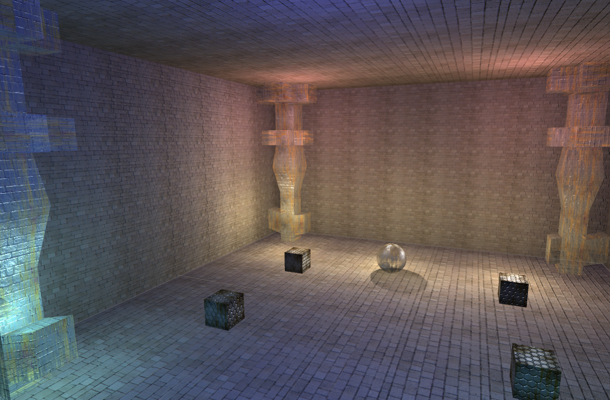

## Static Lighting

The **DaydreamRendererStaticLighting** scene demonstrates static lighting using the **Daydream Vertex Lighting** allowing all surfaces to be affected by a large number of static, normal-mapped lights at almost no additional runtime cost with full specular support. All of the lights are **mixed**, so dynamic objects will still be affected - allowing for easier integration of static and dynamic lighting.

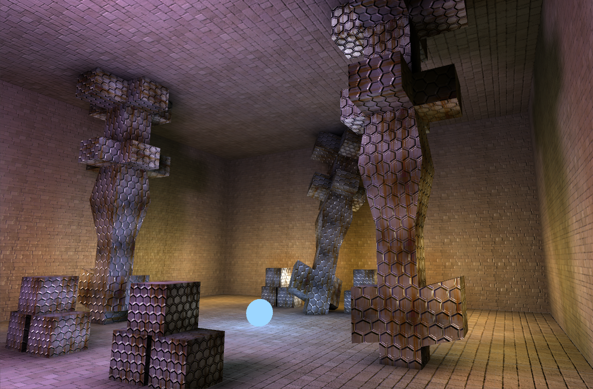

# Materials

To use the lighting system you will need to apply one of the Daydream Renderer shaders to your materials. There are a variety of settings that you can adjust with different visual / performance tradeoffs.

**Daydream/Standard** shader covers most use cases, supporting diffuse and specular with normal maps or detail maps. If you are not sure which one to use, then use this one.

**Daydream/Reflection** shader supports cubemap based reflections.

**Daydream/Diffuse** shader is a simplified shader that may provide better performance if you do not need specular or reflections.

The Specular and Reflection Lightprobe options will expand if those are selected and those sections will be detailed later.

## Base Material Settings

The following settings are available on the material in the Inspector view. Note that some of these settings are only available in specific shaders - those will be called out in parenthesis.

<table>
  <tr>
    <td>Texture</td>
    <td>Albedo texture, RGB is the color and Alpha is used to mask specular or reflections if enabled. Tiling and Offset works the same as the standard Unity shader except that they also apply to the normal map.</td>
  </tr>
  <tr>
    <td>Normal</td>
    <td>The tangent space normal map, where (0, 0, 255) is pointing straight up.</td>
  </tr>
  <tr>
    <td>Reflection Map (Daydream/Reflection)</td>
    <td>Only shows up with the Reflection shader. Artists are responsible for specifying their own cubemaps when using reflections. Rendering and updating cubemaps at runtime incurs too much overhead for mobile VR.</td>
  </tr>
  <tr>
    <td>Base Color</td>
    <td>The RGB is multiplied with the Albedo and Alpha with the specular mask.</td>
  </tr>
  <tr>
    <td>Emissive</td>
    <td>A scalar value (between 0 to 1) that identifies how emissive the surface is, a value of 1.0 will cause the Base Color and Texture to show through without any lighting. The emissive is scaled with the Texture alpha channel, so masked emissive is possible.</td>
  </tr>
  <tr>
    <td>Wrap</td>
    <td>Allows the lighting to "wrap around" to simulate translucency. The default value of 0.0 produces normal “hard” lighting and the value of 1.0 produces very soft lighting that wraps around the object.</td>
  </tr>
  <tr>
    <td>Baked Light Scale</td>
    <td>This value scales the effect of static lighting, whether it's from Lightmaps or Vertex lighting. With a value of 0.0 static lighting has no visible effect and at 1.0 it has full effect. Values above 1.0 causes the static lighting to become “over-bright.” The static lighting example uses this feature to smoothly transition between static light states.</td>
  </tr>
  <tr>
    <td>Smoothness</td>
    <td>Specifies how smooth the surface is. In general smoother surfaces, closer to 1.0, will have sharp, bright specular highlights whereas rough surfaces, closer to 0.0, will have diffused highlights. 0.5 is a good default.</td>
  </tr>
  <tr>
    <td>Shadow Intensity</td>
    <td>Scales the intensity of dynamic shadows affecting this surface. A value of 0.0 will result in completely transparent shadows (i.e. they won’t be visible) and 1.0 will result in darker shadows. 1.0 is a good default.</td>
  </tr>
  <tr>
    <td>Shadow Falloff</td>
    <td>A measure of how quickly shadows will fade with distance from the occluder. At 0.0 the shadows will not fade at all and at 1.0 they will fade away immediately. 0.3 is a good default.</td>
  </tr>
  <tr>
    <td>AO Diffuse</td>
    <td>If Ambient Occlusion is enabled, this scales the effect it has on the Diffuse Lighting, where there is no visible AO at 0.0 and it has full effect at 1.0. The default is 1.0.</td>
  </tr>
  <tr>
    <td>AO Specular</td>
    <td>If Ambient Occlusion is enabled, this scales the effect it has on the Specular Lighting or Reflections, where there is no visible AO at 0.0 and it has full effect at 1.0. The default is 0.0.</td>
  </tr>
  <tr>
    <td>Rendering Mode</td>
    <td>This describes how the surface is rendered, for example Opaque surfaces are completely solid. Render Modes include Opaque, Cutout, Blend, Premultiply, Additive and Multiply.</td>
  </tr>
  <tr>
    <td>Light Count</td>
    <td>The number of dynamic lights enabled for this material. The options are 0, 4 or 8. The fragment shader cost for 4 or 8 lights is exactly the same but the vertex shader cost varies. Note that at least 4 dynamic lights must be enabled for the surface to be lit.</td>
  </tr>
  <tr>
    <td>Particle Rendering</td>
    <td>Optimize for particle rendering. Lit particles are automatically enabled if the Light Count (above) is greater than zero. Usually you want to use Blend, Premultiply or Additive Rendering mode (see above).</td>
  </tr>
  <tr>
    <td>Clamp Attenuation</td>
    <td>With the default Unity lighting model, light doesn’t reach zero before the light is culled. Usually that is fine but sometimes it causes artifacts. Use this setting in those cases - the lighting will fall-off to exactly zero but will appear a little dimmer than standard Unity lights.</td>
  </tr>
  <tr>
    <td>Normal map</td>
    <td>Use the normal map for diffuse and specular lighting. This will give you the best quality and is recommended.</td>
  </tr>
  <tr>
    <td>Normal map - flip Y (green)</td>
    <td>Some normal maps are encoded so that the green channel is flipped compared to what Unity expects, use this setting to handle that case.</td>
  </tr>
  <tr>
    <td>Detail map</td>
    <td>Use the second texture as a Detail map instead of a Normal map. In this case, the RGB of the second map is multiplied with the base color. Usually you will want to have different scale/offset settings for the second map in this case.</td>
  </tr>
  <tr>
    <td>Specular</td>
    <td>Enable the analytical specular approximation from all dynamic light sources (and static light sources once the static lighting system is integrated). This will open up several options which will be detailed later.</td>
  </tr>
  <tr>
    <td>Reflection Lightprobe</td>
    <td>Enable a cubemap based specular approximation instead of analytical specular. This will also open up options that will be detailed below.</td>
  </tr>
  <tr>
    <td>Ambient Occlusion</td>
    <td>Use the alpha channel of the normal map or detail map as Ambient Occlusion. This value is multiplied with the Diffuse and/or Specular lighting to simulate Ambient Occlusion. You will need to bake this value in another tool.</td>
  </tr>
  <tr>
    <td>Shadow Receiver</td>
    <td>This surface can receive dynamic shadows.</td>
  </tr>
  <tr>
    <td>Dynamic Ambient</td>
    <td>Use the dynamic, multi-color ambient in addition to normal lighting.</td>
  </tr>
  <tr>
    <td>Enable Static Lighting</td>
    <td>Enable static lighting for surfaces using the material. Note that the objects themselves must be static as well, otherwise dynamic lighting will be used instead.</td>
  </tr>
</table>

## Specular Settings

<table>
  <tr>
    <td>Fixed Specular Power [LOW]</td>
    <td>Enable this to use a low fixed specular power rather than computing it from the Smoothness. This should improve fragment shader performance slightly, so consider using this option if it matches the desired look. If enabled then Smoothness will only affect the intensity of the specular.</td>
  </tr>
  <tr>
    <td>Fixed Specular Power [MED]</td>
    <td>Enable this to use a medium fixed specular power rather than computing it from the Smoothness. This should improve fragment shader performance slightly, so consider using this option if it matches the desired look. If enabled then Smoothness will only affect the intensity of the specular.</td>
  </tr>
  <tr>
    <td>Colored Specular</td>
    <td>By default specular is monochromatic, enable this to use full colored specular at an increased fragment shader cost. Try toggling the option before deciding to use it, in most cases the visual difference is very small.</td>
  </tr>
  <tr>
    <td>Specular Antialiasing</td>
    <td>By default, specular causes a lot of aliasing along the polygon edges. If this is enabled, centroid sampling is used to avoid sampling outside of the triangles which greatly improves this issue. However there is some cost in performance and not all drivers handle centroid sampling properly, so it is optional.</td>
  </tr>
  <tr>
    <td>Colored Specular</td>
    <td>By default specular is monochromatic - which in the case of cubemaps means that only the green channel is used as intensity. Enable this to use full colored specular at an increased fragment shader cost. Try toggling the option before deciding to use it, in most cases the visual difference is very small. Note that the local lighting environment is used to tint the cubemap results, so often the cubemap color can be ignored.</td>
  </tr>
</table>

## Reflection Lightprobe Settings

Here is an example of the shown reflection cubemap being used in monochrome fashion with a normal map:

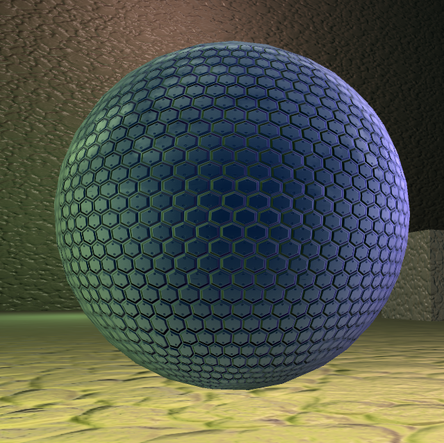

The Base Color is dark blue and Colored Specular is NOT enabled. The colors are coming from the nearby green and purple lights. As you can see the cubemap lookup is not distorted by the normal map, due to the high cost of dependent texture reads on mobile. However other effects that do use the normal map, such as approximate fresnel, the correct impression is given.

## Static Lighting Settings

### Enabling static lighting

To enable static lighting you must mark the game object as static and toggle the ‘Enable Static Lighting’ parameter on the daydream material.

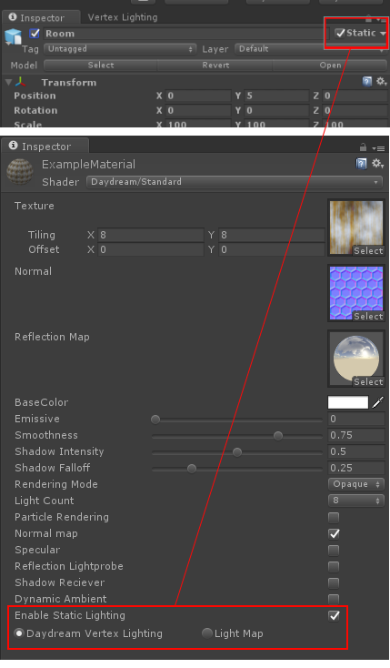

<table>
  <tr>
    <td>Daydream Vertex Lighting</td>
    <td>Enable Daydream vertex static lighting. This computes 3 light values per vertex which is then combined with dynamic lighting. The static lighting is calculated using the same techniques as dynamic lighting but adds high quality shadows and ambient occlusion. This allows for fully normal mapped and seamless static lighting, using the same specular approximation, for almost no additional runtime cost and a modest memory cost. Note that we are still actively working on work flow improvements, so the feature is still "experimental."
</td>
  </tr>
  <tr>
    <td>Light Map</td>
    <td>This allows the surfaces to use built-in Unity lightmap support using Enlighten. Note that for performance reasons directional lightmaps are not supported.</td>
  </tr>
</table>

# Daydream Renderer Component

There are several options available to you in the UI.

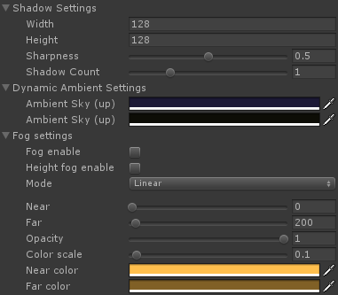

## Dynamic Shadow Settings

The Daydream Renderer supports a limited number of "hero" shadows, typically characters and/or enemies, rather than using scene scale shadows - which should be handled by static lighting. The number of shadow sources is essentially unlimited but the number of shadow casters is limited - ranging from 1 to 4. Here you can decide how many shadow casters you wish to support, the resolution of the shadow maps and the softness of the shadow edges. It is recommended that 1 shadow caster is used, if possible, since the jump for 1 caster to 2 is much larger than the jump from 2 to 3 or 4.

Add the **ShadowCaster** component to objects that you want to cast shadow and enable the **Shadow Reciever** option on materials that should recieve the shadow.

<table>
  <tr>
    <td>Width</td>
    <td>The width of the shadow maps, between 16 and 1024</td>
  </tr>
  <tr>
    <td>Height</td>
    <td>The height of the shadow maps, between 16 and 1024</td>
  </tr>
  <tr>
    <td>Sharpness</td>
    <td>The sharpness of the shadow edges where 0 is blurry and 1 is sharp</td>
  </tr>
  <tr>
    <td>Shadow Count</td>
    <td>The number of shadow casting object sets. Note that casting one shadow costs around 2ms on the Nexus 6P and casting two or more cost an additional 1.8ms on the same hardware. The additional costs going from 2 to 4 are small, the big performance jumps are from 0 to 1 and 1 to 2 shadows. On final hardware or at 1080p, more shadows are possible while maintaining the target frame rate.</td>
  </tr>
</table>

## Dynamic Ambient Settings

Directional ambient allows for the color to change based on the normal, giving much more variation in dark or shadowed areas. For normals pointing "up" - the color will match the first color (“sky”), for normals pointing “down” the color will match the second color (“ground”) and for normals pointing towards the horizon the color will be a 50/50 mix.

<table>
  <tr>
    <td>Ambient Sky (up)</td>
    <td>The ambient color for normals facing towards the sky.</td>
  </tr>
  <tr>
    <td>Ambient Ground (down)</td>
    <td>The ambient color for normals facing towards the ground.</td>
  </tr>
</table>

*[Image: ***_left_*** directional ambient diffuse only, ***_right_*** directional ambient with normal map and specular]*

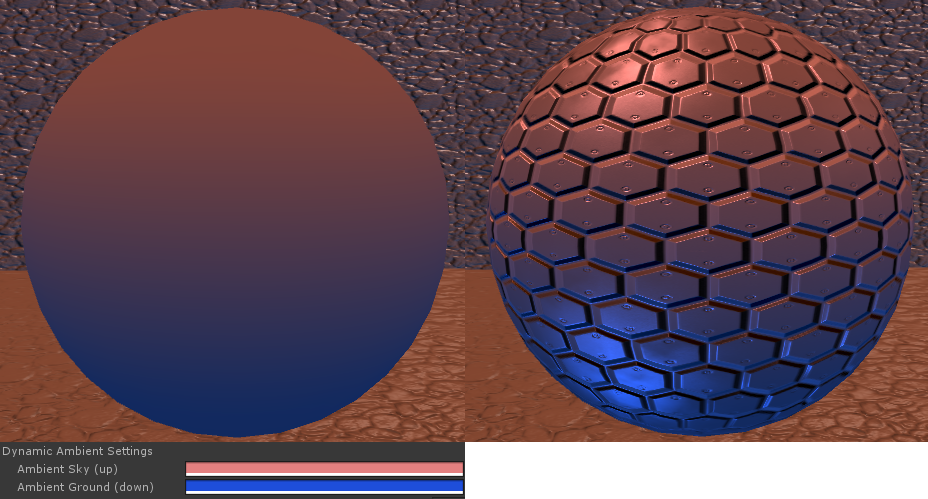

## Fog Settings

Both distanced based and height based fog is supported, where fog values are computed per-vertex to limit the per-pixel cost of adding fog.

<table>
  <tr>
    <td>Fog Enable</td>
    <td>Enable distance based fog.</td>
  </tr>
  <tr>
    <td>Height fog Enable</td>
    <td>Enable height based fog.</td>
  </tr>
  <tr>
    <td>Mode</td>
    <td>Fog falloff mode: 
Linear
Exponential
Exponential Squared

Linear is easiest to control, fog density linearly corresponds to the distance between Near and Far, 25% between Near and Far results in 25% density. Exponential and Exponential Squared modes provide more realistic results but are non-linear</td>
  </tr>
  <tr>
    <td>Near/Far</td>
    <td>Used for Linear fog - the distances where the fog starts accumulating and where the fog is thickest. With an Opacity of 1, the fog will be transparent at the Near distance and opaque at the Far distance.</td>
  </tr>
  <tr>
    <td>Density</td>
    <td>Used for Exponential or Exponential Squared fog - this controls how quickly the fog becomes opaque. Low values result in less dense fog and high values in very dense fog.</td>
  </tr>
  <tr>
    <td>Opacity</td>
    <td>Controls the overall and maximum opacity of the fog. If the opacity is set at 0.5, for example, then the fog will never be more than 50% opaque no matter how much fog you look through.</td>
  </tr>
  <tr>
    <td>Color Scale</td>
    <td>The fog uses a "two color" model - where the fog color blends between the Near Color and Far Color based on distance from the camera. The Color Scale controls the distances over which this effect takes place. Small values will cause the Far Color to become visible at farther distances, large values will cause the Far Color to be visible at closer distances.</td>
  </tr>
  <tr>
    <td>Near/Far Color</td>
    <td>The colors specified in the Color Scale description above.</td>
  </tr>
</table>

*[Left: ***_Color Scale_*** = 0, Far Color not visible; Right: ***_Color Scale_*** = 0.3, Far Color visible at the back wall; Bottom Middle: ***_Color Scale_*** = 1, Far Color dominates]*

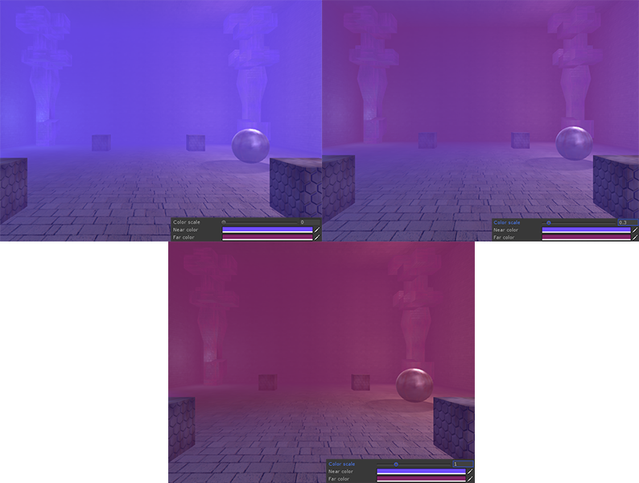

If **Height fog** is enabled, then 3 extra values get added - **Min height**, **Max height** and** Thickness**.

<table>
  <tr>
    <td>Min Height</td>
    <td>The bottom of the fog, where it is thickest.</td>
  </tr>
  <tr>
    <td>Max Height</td>
    <td>The maximum height of the fog, the fog becomes transparent at that height and higher.</td>
  </tr>
  <tr>
    <td>Thickness</td>
    <td>Controls how quickly the fog becomes opaque based on height. Lower values requires more fog to be visible before becoming opaque, higher values tends to show off the height effect more but the fog becomes opaque much faster if the camera is inside. In the image below notice that a lower thickness makes the fog look more transparent when the camera is outside.</td>
  </tr>
</table>

*[Left: Thickness of 10; Right: Thickness of 4]*

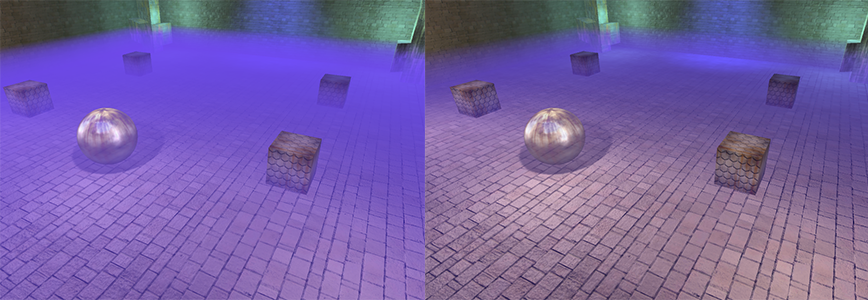

Here is a view with the camera inside the fog using the lower Thickness setting. Notice that the fog looks more opaque once "inside" since the camera is looking through more of it. So generally you want to use larger Thickness values if the camera will stay outside of the fog and use smaller, more “realistic” values when inside. Thickness of 1 is the “correct” value - in that it matches the standard fog. (See the screenshot below)

*[Thickness of 4, viewed from "inside"]*

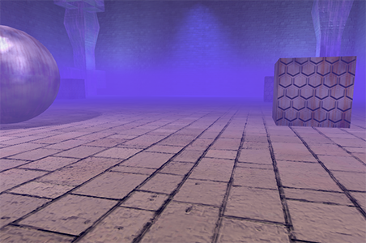

# Dynamic Shadows

## Shadow Casters

For each shadow casting set, the system generates a tight fitting frustum that maximizes shadow map usage, meaning that small shadow maps can give clean looking shadows. Note, however, that this system does not support self-shadowing, since that is very hard to do cleanly on mobile while being performant. So in general you have separate shadow casters and receivers.

To setup a shadow caster, select the object in Unity and add the **Shadow Caster** script component. All of its children will be automatically included. Set the ShadowID to 0, 1, 2 or 3 - this identifies which of the maximum shadow caster slots this will use. Once this script is added, the **Cast Shadows** option in the Mesh Renderer will be honored. As usual change that to On to enable shadow casting on this object.

## Shadow Sources

Any number of lights can be set as shadow sources. Note that a shadow caster will only cast a shadow from one of these lights at a time, however the system will automatically fade the shadows so that it can move from source to source and the shadows will not pop. To flag a light as a shadow source, select it in the Unity editor and add the **Shadow Source** script component. When this script is attached then the system will honor the **Shadow Type** setting on the Light component. Currently **Hard Shadows** and **Soft Shadows** will produce the same results, modified by the global Sharpness setting. Soon the Sharpness setting in the Shadow Source script will be honored, which will allow you to change the sharpness of the shadow edges per light.

## Shadow Receivers

Finally objects that can receive shadows must also be flagged. This will generally consist of static level geometry but that is not required. It is recommended that a Shadow Caster is not also a Shadow Receiver, this will generally produce poor results. To flag an object as a Shadow Receiver, select the object in the Unity Editor and add the **Shadow Receiver** script component. All of its children will be automatically included. Once this component is added, the object will honor the **Receive Shadows** option in the Mesh Renderer. Make sure to enable **Shadow Receiver** on any *materials* that you want to receive shadows.

# Static Vertex Lighting

## Setup

Setting up your objects is done in the same way as normal when using static lighting in Unity. Any materials that you wish to be static lit must be appropriately flagged in the material editor **and **the object must be marked as *static*, see **Daydream Vertex Lighting **in the material editor section above. 

To get to that menu, go to *Window -> Daydream Renderer -> Vertex Lighting*.

## Baking Options

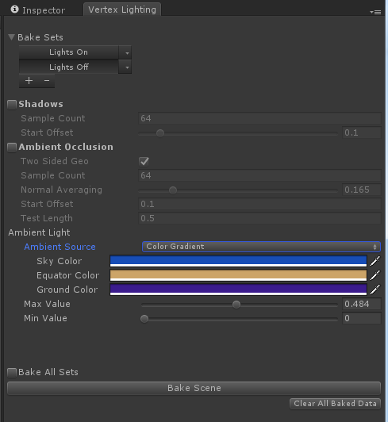

### Shadows

<table>
  <tr>
    <td>Shadows</td>
    <td>The shadows toggle enables static baked shadows. In addition there are Light and Mesh settings that may need to be enabled. See ‘Light Setup’ and ‘Mesh Setup’ below.</td>
  </tr>
  <tr>
    <td>Sample Count</td>
    <td>Adjust the number of samples per-vertex used when generating shadows, higher values produce smoother results but slow down the bake times.</td>
  </tr>
  <tr>
    <td>Start Offset</td>
    <td>Biases the shadow rays to avoid self-intersection.</td>
  </tr>
</table>

### Ambient Occlusion

<table>
  <tr>
    <td>Ambient Occlusion</td>
    <td>Enable baked ambient occlusion.</td>
  </tr>
  <tr>
    <td>Sample Count</td>
    <td>Adjust the number of samples per-vertex used when generating ambient occlusion, higher values produce smoother results but slow down the bake times.</td>
  </tr>
  <tr>
    <td>Start Offset</td>
    <td>Biases the shadow rays to avoid self-intersection.</td>
  </tr>
  <tr>
    <td>Test Length</td>
    <td>Adjusts the scale of the ambient occlusion. Larger values cause more distant geometry to affect the results but will slow down bake times.</td>
  </tr>
</table>

### Ambient Light

<table>
  <tr>
    <td>Ambient Source</td>
    <td>Determines how the ambient light is calculated. At the moment the options are:
Color: use a single color 
Color Gradient: uses a three color model - sky, equator and ground
Color Cube: (similar to a cubemap with a single color per face). In the future Global Illumination may be added, if desired.</td>
  </tr>
  <tr>
    <td>Ambient Color(s)</td>
    <td>The color values used by the static lighting. You will have to set between 1 - 6 colors depending on the Ambient Source selected.</td>
  </tr>
  <tr>
    <td>Min/Max Value</td>
    <td>Once a color palette is chosen the value range can be adjusted. A preview is provided to see how the range will affect the color palette.</td>
  </tr>
  <tr>
    <td>Bake All Sets</td>
    <td>When this option is enabled the baker will re-bake the scene for each bake set in the bake sets list.</td>
  </tr>
</table>

## Light Setup

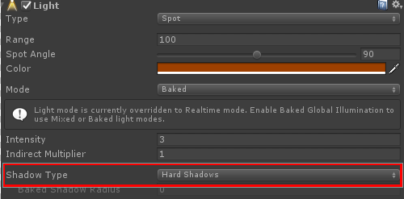

<table>
  <tr>
    <td>Type</td>
    <td>Point, Spot, and Directional are supported.</td>
  </tr>
  <tr>
    <td>Mode</td>
    <td>Static lighting respects all light modes at all times when the Daydream lighting system is enabled. (See the Daydream Lighting System section for more details)</td>
  </tr>
  <tr>
    <td>Shadow Casting</td>
    <td>Setting ‘Shadow Type’ to hard or soft will enable the light to cast static shadows (either mode will enable shadows and both modes will have the same output currently)</td>
  </tr>
  <tr>
    <td>Culling Mask</td>
    <td>The baker also supports light culling in order to light objects selectively.</td>
  </tr>
</table>

## Mesh Setup

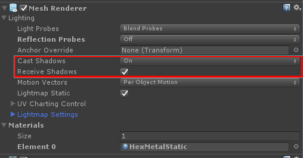

<table>
  <tr>
    <td>Cast Shadows</td>
    <td>Static lighting supports the ‘Mesh Renderers’ ‘Cast Shadow’ options including: On, Off, Two-Sided, and Shadows Only.</td>
  </tr>
  <tr>
    <td>Receive Shadows</td>
    <td>Enable this toggle to receive static shadows.</td>
  </tr>
  <tr>
    <td></td>
    <td></td>
  </tr>
</table>

## Bake Sets

Bake sets allow baking multiple lighting and bake settings configurations for a single scene, and supports switching between the baked sets at runtime.

### Creating a bake set

Click the ‘+’ symbol and enter the bake set name then hit create. The bake set name will be used at runtime to identify the set.

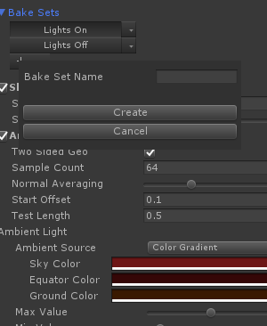

### Bake Set Settings

Bake set lights can be selected using the sets drop down menu. 

<table>
  <tr>
    <td>Light Selection</td>
    <td>Lights at the root of the scene are listed by name. Lights grouped under a game object will be aggregated under that same name in the list; This allows the scene designer to leverage the scene hierarchy to setup light sets.</td>
  </tr>
  <tr>
    <td>Set Name</td>
    <td>The name of the light set can be changed here.</td>
  </tr>
  <tr>
    <td>Active</td>
    <td>If the set is not active it will not be baked when ‘Bake All’ is enabled.</td>
  </tr>
  <tr>
    <td>Force Enable All Lights</td>
    <td>Select this option if you want the bake set to automatically use all lights in the scene. This is useful if you are adding new lights to the scene, as you don’t need to decide to enable or disable a light or a light group.</td>
  </tr>
</table>

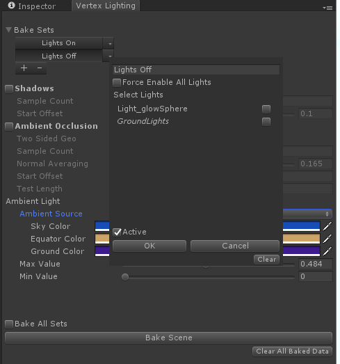

## Vertex Lighting Override

In case of geometry that needs fine tuning, the Vertex Lighting Override script can be applied on a per-object basis. This allows overriding static AO and static shadowing details.

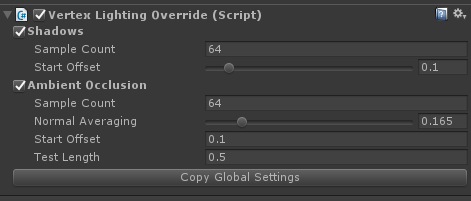

## Clearing Baked Data

To clear the baked data for a scene you can hit ‘Clear All Baked Data’ button. This will clear the baked mesh data for this scene, leaving bake metadata in place.

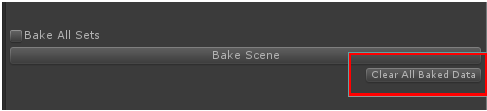

To clear data for a specific bake set you can use the context drop down menu for the bake set in question and hit the ‘clear’ button. This will clear the baked mesh data for that bake set only.

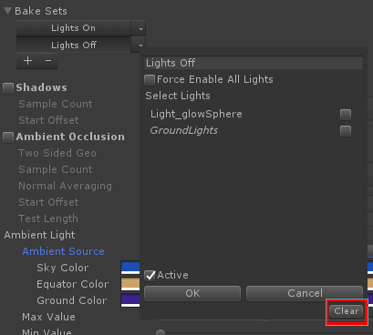

Finally you can always clear all data involved in the bake process by going to the bake folder and deleting the ‘BakeData’ asset. Baked data is stored in alongside the scene file in a folder named after the scene file. The baked data file contains the mesh data and any bake settings and bake-sets you have configured for this scene.

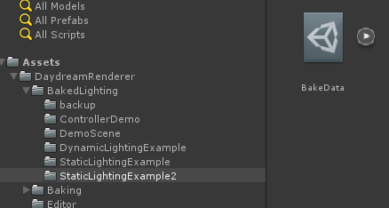

# Daydream Lighting System

Daydream Renderer utilizes a custom lighting system for sorting lights and providing light data to shaders. This allows the renderer to seamlessly provide static vertex lighting support. In order for the lighting system to gather lights (and thus provide that data to materials/shaders) a component is added to each light to feed its data into the system. Also, a component is added to each object with a ‘Renderer’ component in order to feed the necessary object data into the lighting system. These components are auto-added at edit time only, not run time. If you have prefabs that are dynamically loaded at runtime you may need to drag them into the scene in order to automatically add the needed components and then ‘Apply’ the changes to the prefab, or attach the 'Daydream Mesh Renderer' and 'Daydream Light' components through script as needed.

## Disable Daydream Lighting System

To disable the daydream lighting system open Windows->Daydream Renderer->Import Wizard (or open the Daydream Renderer scene object) and toggle the 'Enable Unity Lighting' button.

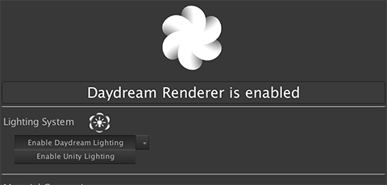

## Disable Auto Add

The Daydream Renderer automatically adds lighting components to the scene. To disable this feature toggle Windows->Daydream Renderer->Import Wizard (or open the Daydream Renderer scene object)

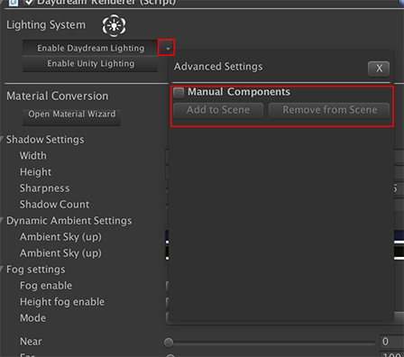

Toggle on the 'Manual Components' option to disable auto add, for convenience you can add and remove the lighting components from the scene using the 'remove' and 'add' buttons.

